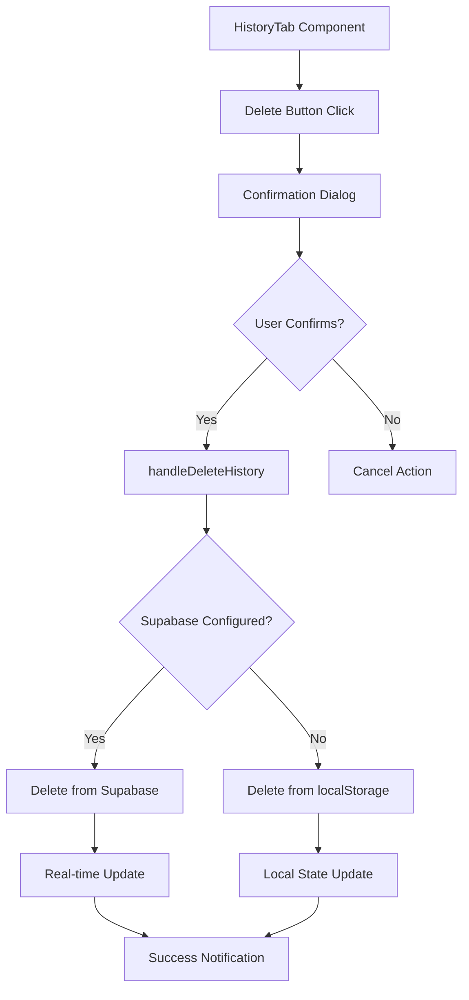

# Delete History Feature Implementation

## 🗑️ **New Feature: Hapus Riwayat Setoran**

A new delete button has been added to the History tab that allows users to delete individual history records.

## ✅ **Implementation Details**

### 1. **Backend Logic (Hybrid Data Store)**

#### Supabase Mode:
- **Function**: `deleteHistory(id: string)`
- **Location**: [`useSupabase.ts`](file://c:\Users\Administrator\Nextcloud\APP MGX\shadcn-ui\src\hooks\useSupabase.ts)
- **Action**: Deletes record from `history` table in Supabase
- **Real-time**: Automatically updates UI across all connected devices
- **Notification**: Shows "Riwayat setoran dihapus" success message

#### localStorage Mode:
- **Function**: `deleteHistory(id: string)`  
- **Location**: [`useDataStore.ts`](file://c:\Users\Administrator\Nextcloud\APP MGX\shadcn-ui\src\hooks\useDataStore.ts)
- **Action**: Removes record from browser localStorage
- **Notification**: Shows "Riwayat setoran dihapus" success message

### 2. **Frontend UI**

#### HistoryTab Component Updates:
- **New Column**: "Aksi" (Actions) column added to table
- **Delete Button**: Red trash icon button for each history record
- **Confirmation**: Shows confirmation dialog before deletion
- **Styling**: Red-themed button with hover effects

#### Features:
- ✅ Confirmation dialog: "Hapus riwayat setoran untuk [Customer Name]?"
- ✅ Error handling with user-friendly messages
- ✅ Automatic UI updates after deletion
- ✅ Success notifications

### 3. **Error Handling**

#### Supabase Errors:
- Network connectivity issues
- Database permission errors
- Record not found errors

#### localStorage Errors:
- Storage quota exceeded
- Browser restrictions

## 🎯 **How to Use**

### For Users:
1. **Go to "Riwayat Setoran" tab**
2. **Find the record** you want to delete
3. **Click the red trash icon** in the "Aksi" column
4. **Confirm deletion** in the popup dialog
5. **Record is deleted** and notification appears

### Testing Steps:
1. Add some sales data
2. Move sales to history using "Setor" button
3. Go to "Riwayat Setoran" tab
4. Try deleting a history record
5. Verify the record is removed and notification appears

## 🔧 **Technical Architecture**

## 📝 **Code Changes Made**

### 1. **useSupabase.ts**
- ✅ Added `deleteHistory` function
- ✅ Added DELETE event handling to real-time subscription
- ✅ Added to return statement

### 2. **useDataStore.ts** 
- ✅ Added hybrid `deleteHistory` function
- ✅ localStorage implementation
- ✅ Added to both Supabase and localStorage return statements

### 3. **HistoryTab.tsx**
- ✅ Added delete button with trash icon
- ✅ Added "Aksi" column to table
- ✅ Added confirmation dialog
- ✅ Added `onDelete` prop interface

### 4. **Index.tsx**
- ✅ Added `handleDeleteHistory` function
- ✅ Connected to hybrid data store
- ✅ Passed to HistoryTab component

## 🛡️ **Security & Data Integrity**

### Confirmation Dialog:
- Prevents accidental deletions
- Shows customer name for clarity
- User must explicitly confirm

### Error Handling:
- Graceful degradation on errors
- User-friendly error messages
- Console logging for debugging

### Real-time Sync:
- Changes appear immediately across devices (Supabase mode)
- Consistent state management
- Automatic notifications

## 🎉 **Benefits**

1. **Data Management**: Users can clean up incorrect or test data
2. **User Control**: Full CRUD operations on history records  
3. **Hybrid Support**: Works both online (Supabase) and offline (localStorage)
4. **Real-time Updates**: Changes sync across devices immediately
5. **User-friendly**: Confirmation dialogs prevent accidents
6. **Consistent UX**: Matches existing delete patterns in the app

The delete history feature is now fully implemented and ready for use! 🚀